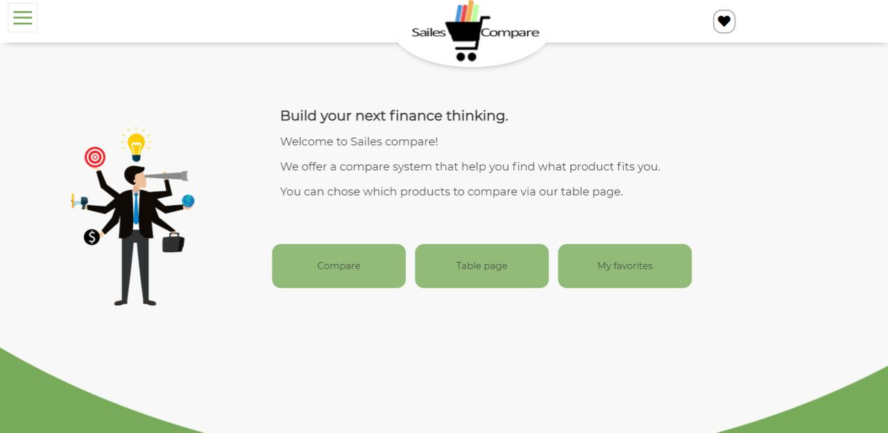
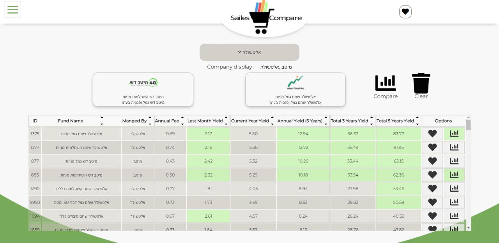
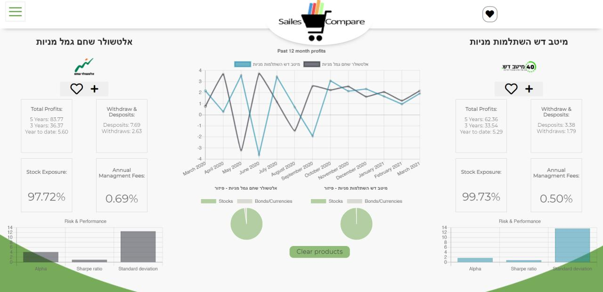
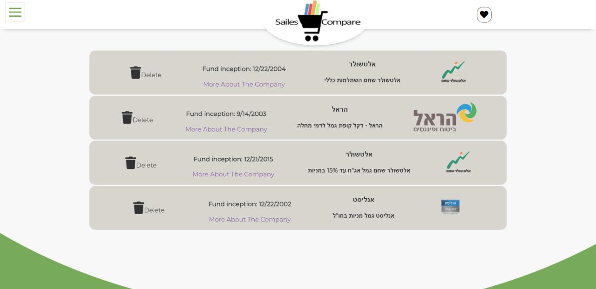

**This is my mid course project. i made a comparisons system of financial products, offered by the top 5 israelies financial groups.
You can compare between 2 different product and see only their relevant data. This website is user friendly and make a basic economy information accessible to everyone, using graphs, cards, colors and more.**

**https://orisailes-mid-course-project.netlify.app/**

<h1>Landing</h1>

**- Landing section - login/register.**

<h1>Table</h1>

**- In this section, user can choose which product to compare, add products to favorites, sort, search by name and display different companies.**

<h1>Compare</h1>

**- After the user chose two product, he can see their performance and get relevant information.**

<h1>Favorite list</h1>

**- Here the user see his favorites product, another information and relevant website reference. The data is stored on Local storage.**

<h2>Try It!
  https://orisailes-mid-course-project.netlify.app/</h2> 
